# Aegis Collect AI Enterprise Architecture

This document defines the production architecture for the collections AI platform without connecting live APIs. The current app remains frontend-only; these contracts and schemas are the target architecture for the backend phase.

## Architecture Principles

- Multi-tenant by default: every operational table is scoped by `organization_id`.
- Event-first call operations: call state is persisted through immutable events, then projected into analytics and realtime surfaces.
- Provider isolation: Vapi, Twilio, ElevenLabs, and OpenAI are behind adapters so campaign logic does not depend on provider SDKs.
- Compliance-first data handling: transcripts, recordings, model prompts, and payment promises are auditable and role-restricted.
- Realtime is derived state: browser subscriptions consume sanitized events, not raw provider webhooks.
- No secrets in frontend: provider credentials live in a vault/KMS-backed runtime configuration.

## System Context

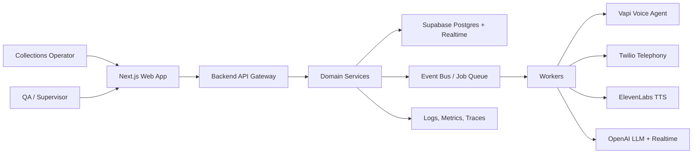

## Recommended Folder Structure

```text
src/
  app/
    (dashboard)/
    api/                         # Future route handlers only; empty in Phase 1
  components/
    app-shell.tsx
    ui.tsx
  features/
    campaigns/
    calls/
    customers/
    voice-agent/
    analytics/
    red-team/
    settings/
  lib/
    mock-data.ts
    utils.ts
  server/
    contracts/
      api.ts
      events.ts
      validation.ts
    db/
      client.ts                  # Future Supabase server client
      repositories/
    services/
      campaigns/
      calls/
      customers/
      analytics/
      red-team/
      voice-agent/
    integrations/
      openai/
      vapi/
      twilio/
      elevenlabs/
    realtime/
    security/
    observability/
supabase/
  schema.sql
  policies.sql                   # Optional split later
  seed.sql                       # Mock seed later
docs/
  enterprise-architecture.md
```

## Database Model

The authoritative SQL is in `supabase/schema.sql`. The conceptual model is:

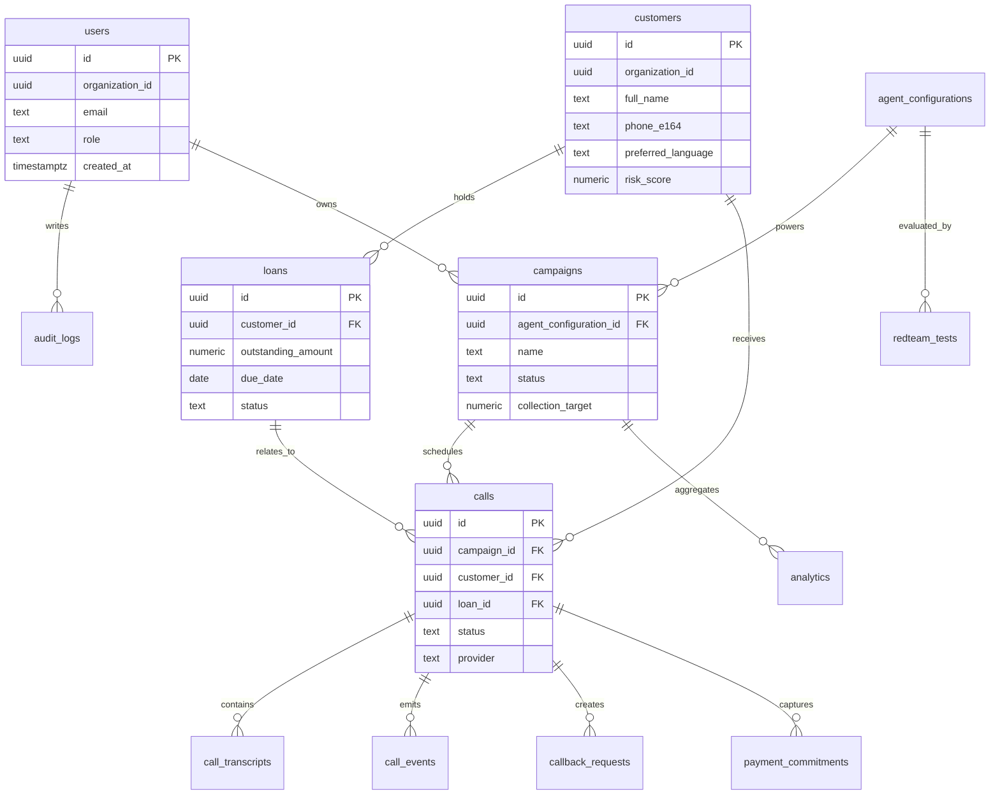

## API Architecture

The backend should expose stable domain APIs, not provider-specific endpoints. Provider webhooks are private ingress routes.

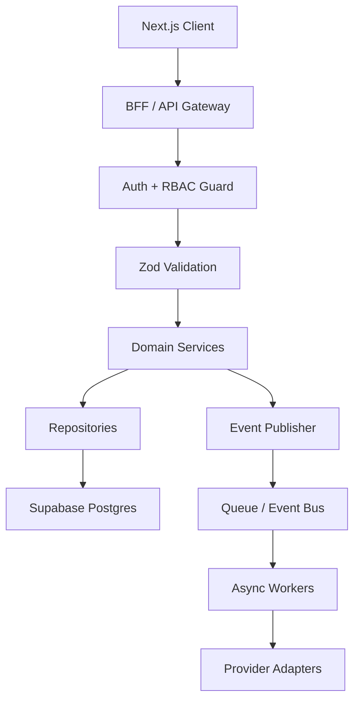

### API Groups

- `/api/customers`: search, detail, timeline, notes, risk profile.
- `/api/loans`: loan detail, aging buckets, outstanding exposure.
- `/api/campaigns`: create, schedule, pause, resume, details, distribution.
- `/api/calls`: start, supervise, outcome, transcript, events.
- `/api/callbacks`: create, assign, reschedule, complete.
- `/api/payment-commitments`: capture, verify, expire, reconcile.
- `/api/agent-configurations`: persona, prompts, voices, languages, flows.
- `/api/redteam-tests`: scenarios, runs, evaluations, policy failures.
- `/api/analytics`: KPI rollups, trends, heatmaps, forecasts.
- `/api/settings`: users, roles, providers, integrations, audit logs.
- `/api/webhooks/vapi`: Vapi call lifecycle ingress.
- `/api/webhooks/twilio`: Twilio status, recording, transcription ingress.
- `/api/webhooks/elevenlabs`: optional voice generation callback ingress.

### Representative Contracts

The TypeScript contract source is `src/server/contracts/api.ts`.

```http
POST /api/campaigns
Content-Type: application/json

{
  "name": "Prime Bucket 1 - North",
  "agentConfigurationId": "uuid",
  "collectionTarget": 84000000,
  "startsAt": "2026-06-05T03:30:00.000Z",
  "filters": {
    "bucket": "1-30",
    "languages": ["hi", "en"],
    "riskScoreMax": 70
  }
}
```

```http
POST /api/calls/start
Content-Type: application/json

{
  "campaignId": "uuid",
  "customerId": "uuid",
  "loanId": "uuid",
  "provider": "vapi"
}
```

```http
POST /api/payment-commitments
Content-Type: application/json

{
  "callId": "uuid",
  "customerId": "uuid",
  "loanId": "uuid",
  "amount": 5000,
  "promisedFor": "2026-06-14",
  "channel": "whatsapp",
  "confidence": 0.92
}
```

## Service Layer Architecture

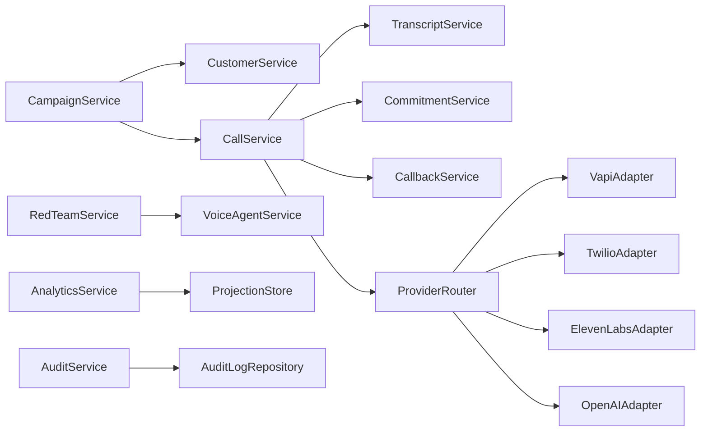

### Services

- `CampaignService`: campaign lifecycle, segmentation, distribution, throttling.
- `CustomerService`: borrower profile, search, risk signals, contact policy.
- `LoanService`: loan status, aging, repayment schedule, exposure.
- `CallService`: call lifecycle, provider routing, status transitions.
- `TranscriptService`: transcript chunk persistence, redaction, speaker labels.
- `CallEventService`: event append, idempotency, state projection.
- `CallbackService`: callback creation, queue assignment, SLA tracking.
- `CommitmentService`: promise-to-pay capture, expiry, verification hooks.
- `VoiceAgentService`: prompts, persona, language, voice, flow configuration.
- `RedTeamService`: scenario orchestration, scoring, policy evaluation.
- `AnalyticsService`: aggregates, rollups, forecasts, heatmaps.
- `AuditService`: immutable audit log writes for sensitive operations.

## Event Architecture

Events should be immutable and idempotent. Use `event_id` as the primary idempotency key when consuming provider webhooks.

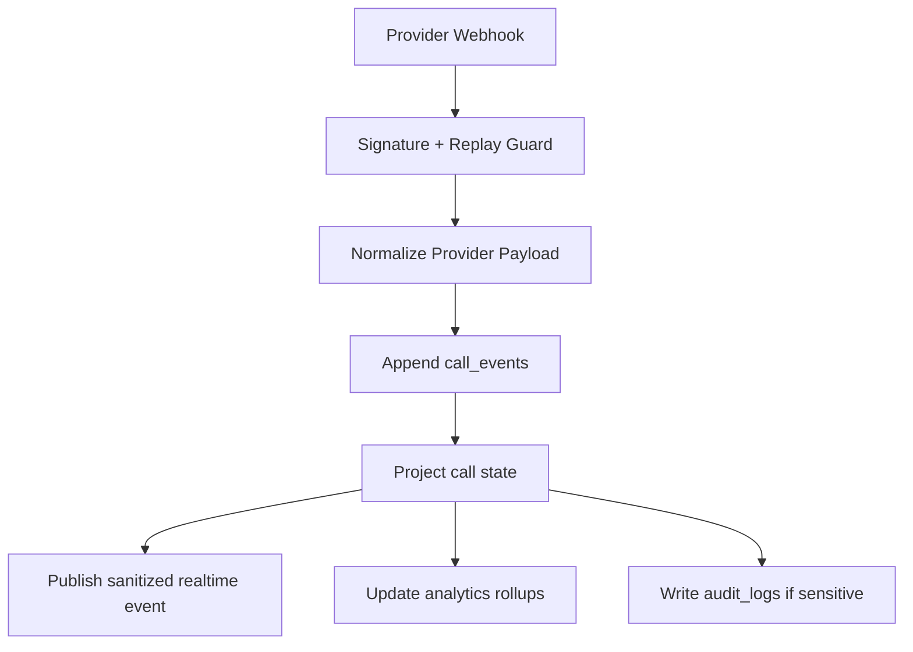

### Canonical Events

- `campaign.created`
- `campaign.started`
- `campaign.paused`
- `call.queued`
- `call.started`
- `call.ringing`
- `call.connected`
- `call.transcript.partial`
- `call.transcript.final`
- `call.sentiment.changed`
- `call.language.changed`
- `call.suggestion.created`
- `call.callback.requested`
- `call.payment_commitment.created`
- `call.escalated`
- `call.completed`
- `call.failed`
- `redteam.test.started`
- `redteam.test.completed`
- `agent_configuration.published`
- `analytics.rollup.completed`

## Realtime Architecture

Use Supabase Realtime for product surfaces and a separate provider webhook channel for raw ingress. The browser subscribes only to organization-scoped, sanitized channels.

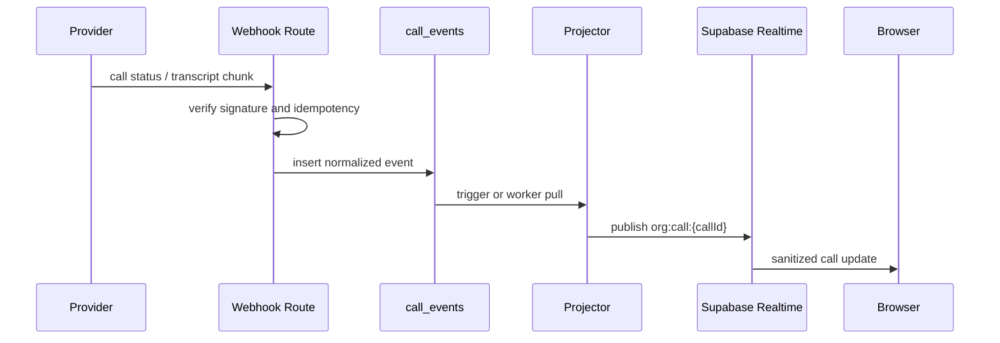

### Channels

- `org:{organizationId}:overview`
- `org:{organizationId}:campaigns`
- `org:{organizationId}:calls`
- `org:{organizationId}:call:{callId}`
- `org:{organizationId}:redteam`
- `org:{organizationId}:notifications`

### Frontend State Management

- Server state: TanStack Query or equivalent query cache in the backend phase.
- Realtime state: channel-specific stores for live calls and notifications.
- Local UI state: existing React state for nav, dark mode, modals, drawers.
- Optimistic state: limited to draft campaign forms and agent builder drafts.
- Persistent preferences: theme, sidebar state, table density, saved filters.

## Provider Integration Architecture

No providers are connected in this phase. The future integration boundary is adapter-based.

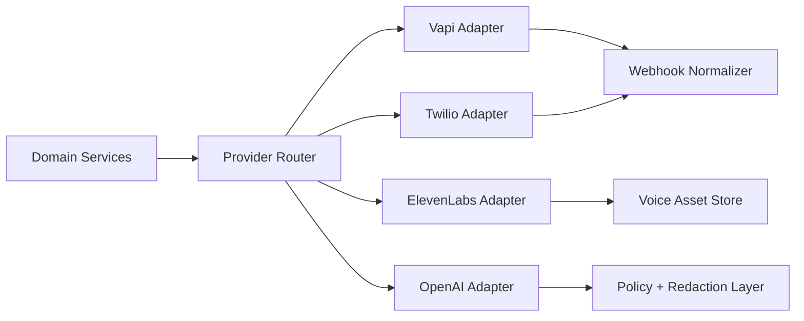

### Vapi

- Purpose: managed voice agent orchestration, outbound call execution, call lifecycle webhooks.
- Adapter responsibilities: create/update assistant configs, initiate outbound calls, map Vapi call IDs to internal `calls.id`, normalize call webhooks, capture transcript events.
- Data boundary: Vapi payloads are stored raw only in restricted diagnostic storage; product tables store normalized events and transcripts.
- Failure handling: retry transient failures, mark provider incidents, support provider failover to Twilio-first flow.

### Twilio

- Purpose: telephony primitives, phone number pools, SIP/PSTN routing, status callbacks, recording lifecycle.
- Adapter responsibilities: outbound dial, call status callback verification, recording metadata ingestion, number pool management.
- Data boundary: never expose Twilio auth tokens to frontend; status callbacks write `call_events`.
- Failure handling: carrier failure classification, retry policy by campaign, number health tracking.

### ElevenLabs

- Purpose: high-quality voice generation and voice selection where not delegated to Vapi.
- Adapter responsibilities: voice catalog sync, TTS generation requests, voice asset cache, usage metering.
- Data boundary: generated audio artifacts are stored with short-lived signed URLs and retention policy.
- Failure handling: fallback voice, cached common utterances, degrade to provider-native voice.

### OpenAI

- Purpose: conversation reasoning, policy-aware suggestions, transcript summarization, red-team scoring, analytics narratives, optional realtime speech intelligence.
- Recommended boundary: use the Responses API for structured reasoning workflows, tool-enabled agent actions, summarization, and evaluations; use Realtime only where the product needs low-latency speech-to-speech or streaming multimodal interaction.
- Adapter responsibilities: prompt assembly, PII redaction, structured output validation, trace metadata, model routing, retry and fallback policy.
- Safety boundary: model output cannot directly mutate payment commitments, callbacks, escalations, or customer records; it proposes actions that services validate.

## Key Sequences

### Outbound Campaign Call

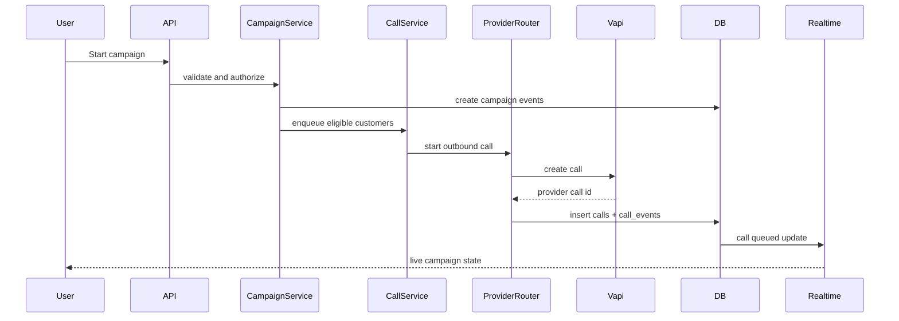

### Promise To Pay Capture

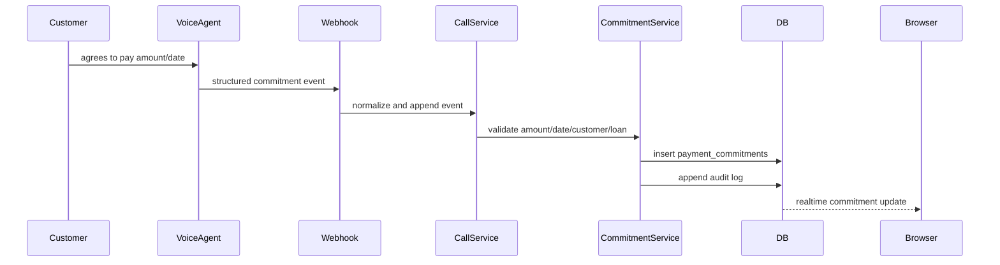

### Red Team Run

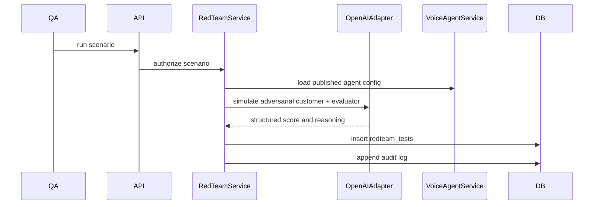

## Security Architecture

- Authentication: Supabase Auth or enterprise SSO later; all server routes require user session.
- Authorization: role-based access plus organization scoping. Roles: `owner`, `admin`, `campaign_manager`, `supervisor`, `agent_operator`, `qa_reviewer`, `analyst`, `auditor`.
- RLS: enabled on all Supabase tables, scoped to `organization_id`; service role used only in backend workers.
- Secrets: provider keys in managed secrets/KMS; never stored in source or exposed to client bundles.
- Webhook security: verify provider signatures, enforce timestamp tolerance, reject replayed event IDs.
- PII controls: phone and email fields are restricted; raw recordings and full transcripts require elevated roles.
- Prompt safety: redact customer PII before model calls unless explicitly required; store prompt versions and model metadata.
- Auditability: all mutations to campaigns, agent configs, commitments, callbacks, roles, and provider settings write `audit_logs`.
- Retention: transcripts, recordings, and raw webhook payloads follow configurable retention by organization and region.

## Observability Architecture

- Logs: structured JSON logs with `request_id`, `organization_id`, `user_id`, `call_id`, `campaign_id`, `provider`.
- Metrics: call connect rate, answer rate, PTP rate, collection rate, provider latency, LLM latency, webhook lag, event projector lag, error rate.
- Traces: API request -> service -> repository/provider adapter -> event publication.
- Alerts: provider webhook failures, abnormal call failure rates, transcript ingestion lag, commitment creation failures, RLS policy denials, red-team fail spikes.
- Dashboards: executive KPIs, campaign health, provider health, model safety, realtime infrastructure, database load.
- Audit review: immutable `audit_logs` with before/after JSON for sensitive changes.

## Deployment Architecture

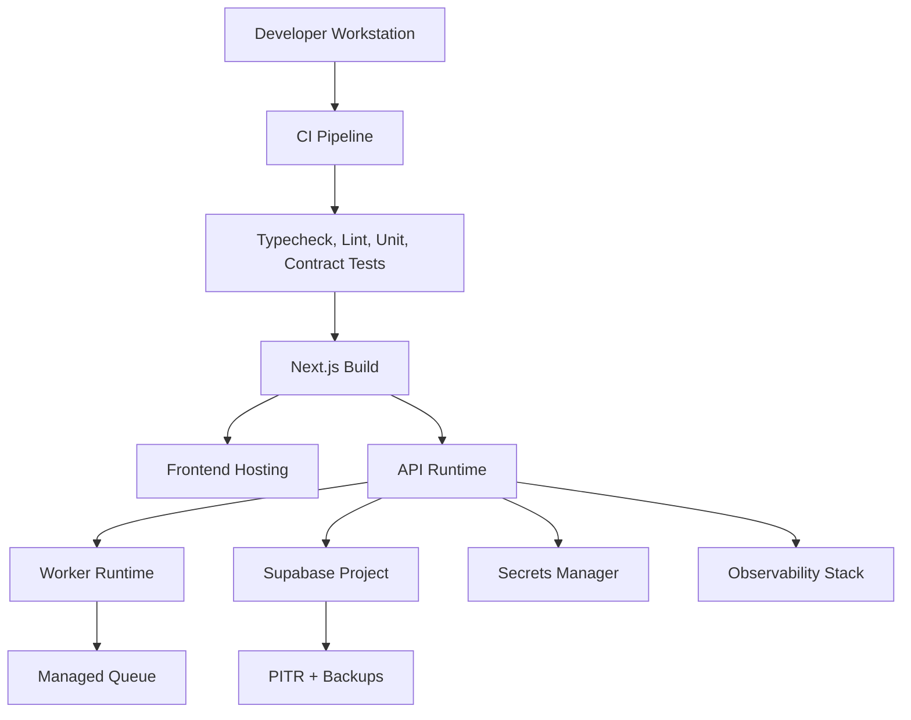

### Environments

- `local`: mock data, local Supabase optional, provider stubs.
- `staging`: Supabase staging, provider sandbox accounts, synthetic customers only.
- `production`: production Supabase, locked secrets, RLS required, audit logs immutable.

### Release Gates

- Schema migration review.
- RLS policy test suite.
- Contract test suite for API payloads.
- Provider webhook replay tests.
- Red-team regression suite before publishing a voice agent configuration.

## Implementation Phases

1. Keep frontend mock mode as the default.
2. Add Supabase project and run schema migration.
3. Add repository layer with typed database access.
4. Add API route handlers with Zod validation and RBAC guards.
5. Add event append/projector services.
6. Add provider stubs, then sandbox integrations.
7. Add realtime subscriptions to replace mock live updates.
8. Add observability, audit review, and security tests.

